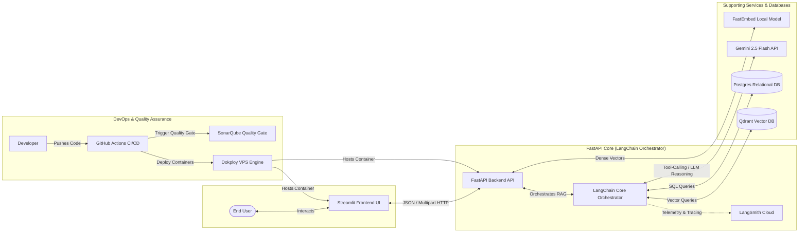
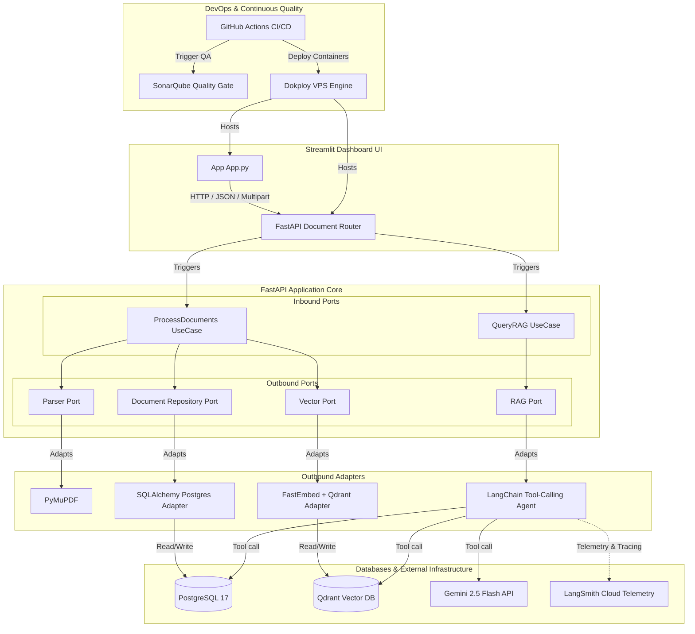
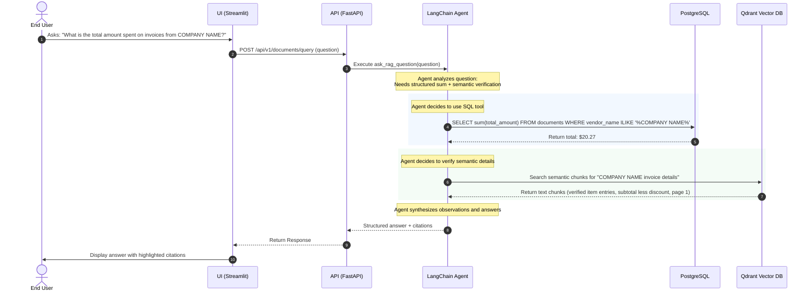
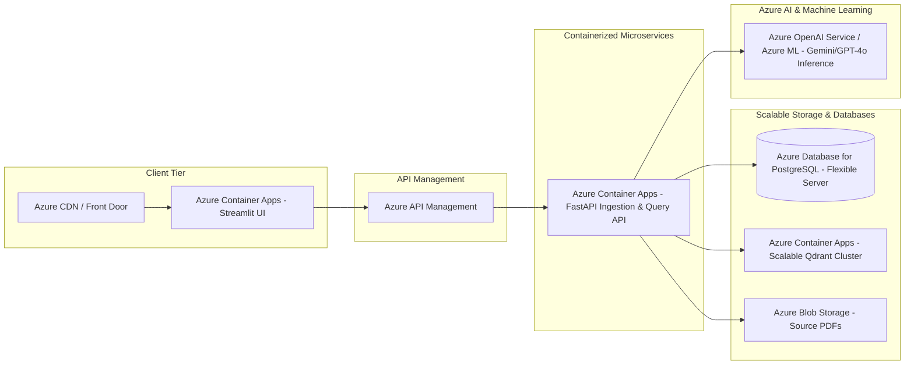

# 🗃️ Hybrid Agentic RAG System — Document Intelligence Platform

[](https://github.com/SergioZona/invoice-hybrid-rag/actions)
[](https://sonar.zonahub.dev/dashboard?id=invoice-hybrid-rag)
[](https://sonar.zonahub.dev/dashboard?id=invoice-hybrid-rag)
[](https://www.python.org/)
[](#)

I designed and built this state-of-the-art **Document Intelligence & Hybrid Agentic RAG Platform** to ingest complex PDF invoices and business documents, extract structured metadata, generate dense vector embeddings, and support natural language reasoning using dynamic tool-calling.

---

## 🚀 Quick Start (Fast Start)

Get the entire system running locally in under 3 minutes using Docker Compose:

```bash
# 1. Clone the repository and navigate to the root directory
# 2. Build and start all infrastructure and application containers
docker compose --env-file docker/.env -f docker/docker-compose.yml up -d --build

# 3. View running containers and verify their health status
docker ps
```

Once running, you can access the following local endpoints:
* **Streamlit UI Dashboard**: `http://localhost:8501`
  * *Credentials for Basic Authentication*:
    * **Username**: `admin`
    * **Password**: `admin123` (configured via `docker/.env`)
* **FastAPI Swagger Documentation**: `http://localhost:8000/docs`
* **Qdrant Vector Database Console**: `http://localhost:6333/dashboard`

---

## 🎥 Video Demo

Work in progress.

---

## 📊 Business Canonical Schema & Dynamic Open-Schema

To maximize flexibility when parsing highly variable business documents and invoices, the platform uses a hybrid **Fixed-Relational + Dynamic JSONB (Open-Schema)** representation. Instead of demanding a database schema migration for every unique vendor invoice template, we isolate critical analytical properties into canonical columns and offload all other variables into open JSONB fields.

### 1. The 7 Structured Canonical Columns
Every processed document is automatically resolved into these 7 relational fields in the PostgreSQL database. This facilitates sub-millisecond sorting, grouping, and filtering:

| Canonical Field | Description | `Sample Invoice Template.pdf` Value |
| :--- | :--- | :--- |
| **`document_type`** | General classification of the document | `"invoice"` |
| **`doc_date`** | Standardized transaction date (YYYY-MM-DD) | `"2024-08-08"` |
| **`doc_number`** | Invoice or statement serial number | `"76543"` |
| **`vendor_name`** | Issuing company or professional service | `"COMPANY NAME"` |
| **`client_name`** | Recipient entity or billing department | `"<Client Company Name>"` |
| **`total_amount`** | Grand total (balance due) of the invoice | `20.27` |
| **`tax_amount`** | Aggregated tax value applied | `1.28` |

### 2. Tabular Line Items Extraction (`tables` JSONB Column)
For structured items list (like rows in an invoice template containing quantity, description, unit price, and total), the system parses them into an open-schema array of maps (`tables`). This avoids complex relational table normalization while preserving queryability:
```json
[
  {"description": "Item 1", "quantity": 1, "unit_price": 5.00, "total": 5.00},
  {"description": "Item 2", "quantity": 1, "unit_price": 7.00, "total": 7.00},
  {"description": "Item 3", "quantity": 1, "unit_price": 6.00, "total": 6.00}
]
```

### 3. Open-Schema JSONB Overflow (`extras` Column)
All other fields extracted by the Gemini LLM that are not part of the 7 canonical columns are placed in an unconstrained `extras` JSONB map. Users can dynamically add, update, or remove key-value attributes via the Streamlit UI without altering database tables.
For the `Sample Invoice Template.pdf` example, `extras` captures:
* **`subtotal`**: `18.00`
* **`discount`**: `2.00`
* **`subtotal_less_discount`**: `16.00`
* **`tax_rate`**: `"8%"`
* **`shipping_handling`**: `2.99`
* **`payment_terms`**: `"due within Net 30 days"`
* **`payment_instructions`**: `"Venmo: <venmo account> or Paypal: <paypal account>"`

---

## 🎨 1. System Architecture & Tech Decisions

I built this platform adhering strictly to **Clean Architecture & Hexagonal (Ports & Adapters) principles** to decouple the domain business logic from external frameworks, databases, and third-party AI APIs.

### A. High-Level Architecture Flow

This diagram outlines the complete request-response and delivery lifecycles, incorporating local and remote environments, DevOps pipelines, quality gate analysis, and multi-cloud telemetry/observability integrations:




### B. Detailed Module & Hexagonal Architecture Flow

To ensure high modularity and maintainability, I isolated the core business rules from external technologies. Control flows through outbound ports, which are implemented by exchangeable infrastructure adapters, with complete DevOps deployment and monitoring tracing:



### Key Technical Stack & Design Rationale
* **UI (Streamlit)**: I chose Streamlit for rapid front-end engineering. It enables seamless PDF uploads, real-time extraction logging, interactive human-in-the-loop comparison, and a chat interface.
* **Backend (FastAPI)**: I selected FastAPI due to its asynchronous runtime (ASGI) support, enabling highly concurrent processing during document upload spikes.
* **Orchestration (LangChain Agent)**: I integrated a tool-calling reasoning agent that parses conversational queries, decides whether to query PostgreSQL (using SQL tools) or Qdrant (using semantic search tools), and synthesizes a citation-rich response.
* **Vector Store (Qdrant)**: I deployed Qdrant because of its sub-millisecond similarity search speeds and low resource utilization.
* **Relational DB (Postgres 17)**: Structured metadata storage featuring a strict relational schema alongside a **JSONB open-schema column** (`extras`) and structured tabular lists (`tables`) to ingest dynamic business invoice fields without schema migrations.
* **AI Inference (Gemini 2.5 Flash)**: I leveraged the Gemini 2.5 Flash model through Google's official AI SDK as the agentic model, providing high reasoning speeds, generous rate limits, and solid code-generation tools.
* **FastEmbed In-Memory Offloading**: I offloaded vector generation to local CPU-bound threads managed by FastEmbed, wrapping executions in `asyncio.run_in_executor` to keep the FastAPI main async event loop unblocked.

---

## 🔮 2. Deep Dive RAG Architecture & Theoretical Foundations

### 🏷️ Architectural Taxonomy: Agentic Hybrid SQL-Vector RAG (Structured-Unstructured Query Router)

I designed and engineered the retrieval engine of this platform around a state-of-the-art **Agentic Hybrid SQL-Vector RAG** architecture (also known in industry and academic literature as **Structured-Unstructured Query Router RAG**).

#### 1. Why this approach? The Dual-Retrieval Paradigm
Standard RAG pipelines rely solely on unstructured dense retrieval (vector database lookups). While excellent for answering conceptual questions ("What is the process for X?"), pure vector search is notoriously fragile when handling structured financial data, precise numerical aggregation, and strict relational filtering. For example, a vector search looking up *"What is the sum of Sergio's gross income in 2026?"* will often hallucinate or retrieve unrelated tax rows, because math operations and precise equality filters are outside the capabilities of dense vector spaces.

To mitigate this bottleneck, my system splits the knowledge representation into a dual-storage paradigm:
*   **Structured Relational Schema (PostgreSQL 17):** Captures high-precision, strict canonical fields (document type, date, number, vendor, client, totals), dynamic line item lists (`tables`), and arbitrary dynamic attributes in an **open-schema JSONB extras column**. This ensures 100% mathematical accuracy and strict querying capability for quantitative, relational questions.
*   **Unstructured Vector Index (Qdrant DB):** Stores high-fidelity recursive semantic text chunks vectorized via local **BAAI/bge-small-en-v1.5** embeddings. This preserves semantic nuance, explanatory footnotes, and structural sections.

#### 2. Why "Agentic"?
The retrieval is orchestrated by a **LangChain Agent** that uses Google Gemini 2.5 Flash as its primary reasoning engine. Rather than a static, hardcoded retrieval flow, the agent dynamically evaluates the user's prompt at runtime, selects the appropriate retrieval tools, chains multiple queries together if needed, and validates the retrieved data before formulating a response.
*   *Quantitative Queries* trigger the agent's **SQL query tool** to execute precise SQL operations (e.g., `SUM`, `AVG`, `GROUP BY`, `ILIKE`).
*   *Conceptual Queries* trigger the agent's **Vector similarity tool** to fetch dense textual chunks from Qdrant.
*   *Hybrid Queries* (e.g., "Find the sum of income and explain note 3") trigger both tools sequentially or in parallel, fusing structured SQL results with unstructured footnotes to generate a comprehensive, accurate answer.

---

I built a **Hybrid Agentic RAG Architecture** that marries unstructured semantic search (dense retrieval) with structured tabular SQL queries:




### 🚀 Parallel Processing & Bottleneck Mitigation

Ingesting large document batches poses critical bottlenecks: heavy network I/O during LLM parsing/LLM tool calls and CPU saturation during vector calculation. 

To solve this, I designed a non-blocking asynchronous pipeline:
1. **Asynchronous Batching**: The FastAPI ingestion endpoints schedule document processing concurrently using Python's standard `asyncio.gather`. 
2. **CPU offloading**: CPU-intensive operations (such as generating embeddings with FastEmbed and parsing PDF pages via PyMuPDF) are offloaded to separate background workers using `asyncio.run_in_executor` mapped to a custom `ThreadPoolExecutor`.
3. **Control Flow Separation**: This decouples I/O tasks (network queries to Gemini, queries to Postgres/Qdrant) from blocking synchronous CPU operations, keeping the main ASGI async loop unblocked to continue resolving active requests.

**Near-Constant scaling performance**:
* **1 PDF Ingest**: Takes ~2.0 seconds (PDF text extraction, local 384-dim FastEmbed vectorization, and Gemini schema validation).
* **5 PDFs Batch Ingest**: Due to concurrent I/O task scheduling and thread-pool execution, the system processes all 5 files in parallel, completing the entire batch in just **~2.2 seconds** instead of a linear 10 seconds!

---

### ✂️ Chunking Strategy: Recursive Character Splitting

To index documents into a vector space, raw text must be split into chunks. I selected the **Recursive Character Text Splitter** for this project. Below, I compare this decision against other splitters to highlight why it fits best:

| Chunking Strategy | Mechanism | Pros | Cons | Suitability for Tax Certificates |
| :--- | :--- | :--- | :--- | :--- |
| **Recursive Character Splitting** *(Used)* | Recursively splits by `\n\n`, `\n`, ` `, and `""` to stay under length constraints. | Preserves semantic paragraph bounds, keeps list structures and rows together. | Overhead from iterative calculations. | **High (9.5/10)**: Prevents numerical entries in line item rows from losing their context. |
| **Fixed-Size Chunking** | Blindly splits at fixed character thresholds (e.g. every 500 characters). | Computationally trivial and fast. | Cuts sentences, tables, and important numbers in half. | **Low (2/10)**: Frequently breaks financial numbers from their labels. |
| **Semantic Chunking** | Splits based on embedding similarity shifts between adjacent sentences. | Excellent semantic cohesion. | Very slow and expensive (requires constant embedding calls). | **Medium (6/10)**: Highly precise, but excessive latency blocks fast user uploads. |
| **Page-by-Page Chunking** | Hard splits at PDF page boundaries. | Highly intuitive; aligns directly with visual pages. | Large pages exceed LLM token windows; breaks sentences on page cuts. | **Low (4/10)**: Page boundaries are arbitrary relative to long financial tables. |

I configured the splitter with a **500-character chunk size** and a **50-character overlap** to ensure that boundary context is never lost.

---

### 📐 Embedding Strategy: BAAI/bge-small-en-v1.5

I chose the **BAAI/bge-small-en-v1.5** model via FastEmbed to generate text vectors:
* **Token Footprint**: It outputs **384-dimensional dense vectors**. This is highly memory-efficient, reducing RAM requirements and database vector index sizes by 4x compared to larger 1536-dimensional models.
* **MTEB Benchmark Performance**: Ranked at the top tier of the [Hugging Face Massive Text Embedding Benchmark (MTEB)](https://huggingface.co/spaces/mteb/leaderboard) for retrieval tasks, beating out many proprietary APIs.
* **Zero Cost & Cost Efficiency**: The model runs entirely locally in the application container. I saved 100% on embedding API costs, gained robust offline capabilities, and removed network roundtrip latencies from the ingestion pipeline.

---

## ☁️ 3. Azure Cloud Scale Translation

To transition this architecture from my local container environment to a production-grade enterprise deployment on **Microsoft Azure**, I mapped out the following scalable cloud migration path:



### Azure Services Mapping
* **Compute**: **Azure Container Apps (ACA)** hosts Streamlit and FastAPI microservices with serverless auto-scaling.
* **Storage**: **Azure Blob Storage** for raw PDFs, **Azure Database for PostgreSQL (Flexible Server)** for relational columns, and **Qdrant on ACA** for vector indexing.
* **AI & Gateway**: **Azure OpenAI Service** for secure reasoning, and **Azure API Management** to route and secure endpoints.

### 🛠️ Infrastructure as Code (IaC): Terraform for AKS
To address the complexity of AKS deployment, I wrote a comprehensive, declarative Terraform blueprint located at `docker/aks-infrastructure/main.tf`. 

This script automates the complete provisioning of:
* A secure Virtual Network (VNet) with delegated database and compute subnets.
* An Azure Container Registry (ACR) to build/store my private Streamlit and FastAPI Docker images.
* An AKS cluster running standard D2s-v5 system pools with integrated pull authentication grants to the ACR.
* A PostgreSQL Flexible Server deployed inside its private subnet delegating private DNS zone virtual links.

You can initialize and plan this infrastructure by executing:
```bash
cd docker/aks-infrastructure
terraform init
terraform plan -out=aks.tfplan
```

---

## 📂 4. Configuration & Secrets Architecture

I split configuration variables and secrets cleanly to ensure no credential leaks occur:

* **Config (Safe to Commit)**: Non-sensitive variables (like database names, ports, logging levels, and allowed hostnames) are stored in `src/env/{APP_ENV}.env` and committed to Git. Pydantic-settings loads the appropriate environment variables automatically at startup based on the `APP_ENV` variable.
* **Secrets (NEVER Commit)**: Sensitive credentials (like database passwords, LLM API keys, and basic auth credentials) are stored in `docker/.env` locally and injected directly via environment variables in Dokploy or GitHub Actions at runtime.

---

## 🛠️ 5. Setup & Execution

### Local Docker Ingestion & Database Exposure
The PostgreSQL database and Qdrant vector database ports are exposed directly to the host to facilitate local administration:

* **Local DB Port**: `5432`
* **Local Qdrant Port**: `6333` (Web Dashboard: `http://localhost:6333/dashboard`)

#### Local DB Connection Using DBeaver
1. Open DBeaver.
2. Create a new connection and select **PostgreSQL**.
3. Fill in the connection settings:
   * **Host**: `localhost`
   * **Port**: `5432`
   * **Database**: `app_dev` (or `app_prod` for production containers)
   * **Username**: `app`
   * **Password**: *[Retrieve `DATABASE_PASSWORD` from your local `docker/.env` file]*
4. Click **Test Connection** and connect!

---

### Remote Dokploy VPS Deployment & Security Guide
In the remote VPS environment managed by Dokploy, direct public exposure of database ports is highly discouraged due to brute-force threats. 

#### Recommended: DBeaver SSH Tunneling (PostgreSQL)
SSH Tunneling allows DBeaver to route PostgreSQL traffic securely through the server's SSH gateway without opening port `5432` to the public:

### Local Docker Ingestion
Launch the entire system locally:
```bash
docker compose --env-file docker/.env -f docker/docker-compose.yml up -d --build
```

---

## 🧪 6. Testing, Quality & CI/CD

The CI/CD pipeline runs on every push and pull request via GitHub Actions, enforcing automated testing, type checking, and quality gates.

```bash
# Run tests, types, and formatters
uv run pytest --cov=src
uv run mypy src/
uv run ruff check src/ tests/
uv run ruff format --check src/ tests/
```

---

## 🧗 7. Key Tradeoffs & Decisions

* **Security & Auth**: Basic authentication is used between the Streamlit UI and FastAPI backend as a lightweight, strategic constraint for decoupled microservice communication.
* **Extraction Strategy**: Fast, native extraction is prioritized using PyMuPDF, skipping heavy OCR visual reconciliation pipelines unless documents are non-selectable scans.
* **Dedicated Vector DB**: Running a dedicated Qdrant instance offloads high-speed similarity search workloads, keeping transactional PostgreSQL connections unburdened.

---

## 🚀 8. Future Roadmap

1. **Interactive BI Analytics**: Real-time spending charts and custom analytics directly inside the Streamlit dashboard.
2. **Conversational Memory**: Native stateful context retention inside the LangChain tool agent for multi-turn chats.
3. **Semantic Caching**: Vector-based query caching to bypass LLM execution for duplicate/similar prompts.
4. **Queue Processing**: Event-driven background ingestion (Celery/Redis) to handle massive PDF batch uploads without API timeouts.
5. **Production Observability**: Full OpenTelemetry spans exported to Grafana and SumoLogic alongside LangSmith telemetry.
