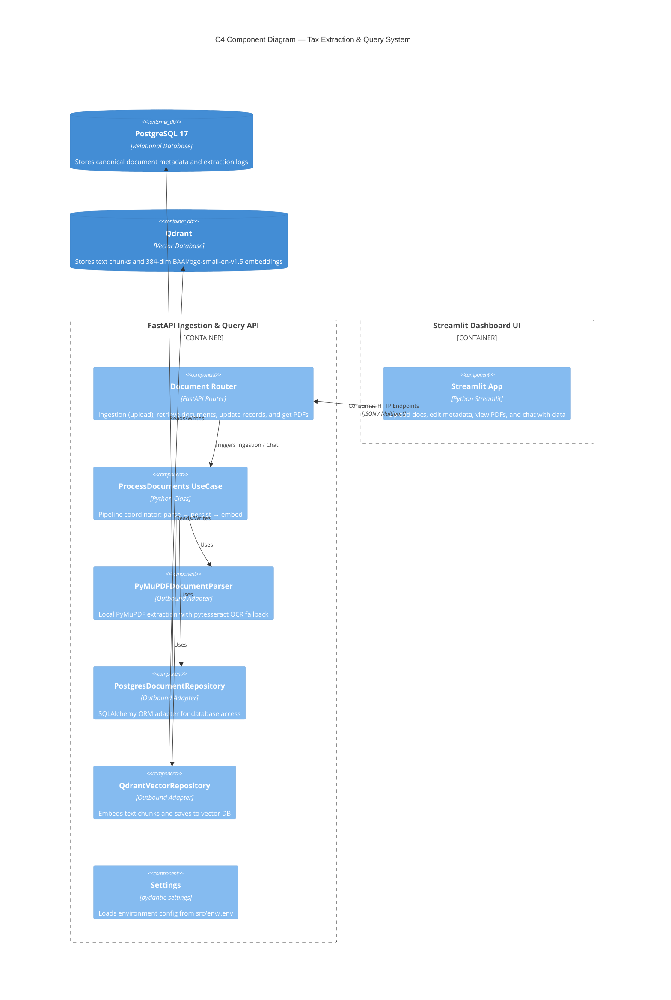

# AI Engineer Take-Home Exercise: Tax Document Extraction & RAG API

This repository implements the solution to the **AI Engineer Take-Home Exercise**. It is a document intelligence platform designed to ingest PDF tax certificates (such as Form 220 and other formats), extract their structured metadata and financial metrics, store them in a database, and support natural language queries over the processed data.

---

## 🎨 System Architecture

### C4 Component Diagram



---

## ⚙️ Processing & Extraction Pipeline

1. **Text Extraction**: The PDF is parsed using **PyMuPDF**.
2. **OCR Fallback**: If the extracted text has fewer than 50 characters, it falls back to **Tesseract OCR** on page images to handle scanned documents.
3. **Canonical Mapping**: Structured fields are extracted using a hierarchical fallback strategy:
   * *Positional Mapping*: Parses sequential structured values if the document matches the Form 220 template layout.
   * *Regex Heuristics*: Standard pattern matching for NIT, names, and numbers.
   * *AI LLM Extraction*: Call Gemini or OpenAI to extract fields into the schema as a fallback.
4. **Chunking & Vector Storage**: Chunks the text (500 chars, 50-char overlap) and stores the embeddings in **Qdrant** for semantic search.
5. **Relational Storage**: The parsed document information is saved to **PostgreSQL**.

---

## 🚀 Setup & Execution

### Prerequisites
- Docker & Docker Compose
- Python 3.14+
- Tesseract OCR (for scanned PDF extraction)

### 1. Launch Infrastructure
Start PostgreSQL and Qdrant in the background:
```bash
docker compose -f docker/docker-compose.local.yml up -d
```

### 2. Configure Environment
Copy the environment file or use the preconfigured default `src/env/.env`:
```bash
# Optional API keys to enable LLM extraction fallback and LLM-powered chat routing:
export GEMINI_API_KEY="your-gemini-api-key"
export OPENAI_API_KEY="your-openai-api-key"
```

### 3. Start Backend API
Run the FastAPI server locally:
```bash
uv run --env-file src/env/.env uvicorn app.infrastructure.main:app --reload
```
*Note: Use forward slashes (`/`) for the `--env-file` parameter path to avoid PowerShell backslash escape errors.*

Interactive Swagger documentation will be available at: **http://localhost:8000/docs**

### 4. Start Streamlit UI
Run the frontend dashboard to upload PDFs, edit/verify extracted data, and chat:
```bash
uv run streamlit run ui/app.py
```
Open **http://localhost:8501** in your browser.

---

## 🧪 Development, Quality & Tests

```bash
# Run test suite and check code coverage (enforcing >80%)
uv run pytest --cov=src --cov-report=term-missing

# Run Ruff linter
uv run ruff check src/ tests/

# Run Mypy static type checker
uv run mypy src/
```

---

## 💡 Engineering & Scaling Decisions

* **Concurrence & Parallel Processing**: Multiple PDF uploads are executed concurrently using `asyncio.gather` to saturate I/O wait times. The heavy machine learning task of generating text embeddings (FastEmbed) runs on a dedicated thread executor via `asyncio.run_in_executor` to avoid blocking FastAPI's main event loop.
* **Human-in-the-Loop Verification**: Since AI extraction is probabilistic, the Streamlit UI provides a form to review and correct metadata side-by-side with the original PDF. Changes are saved back to PostgreSQL using a `PATCH` endpoint.
