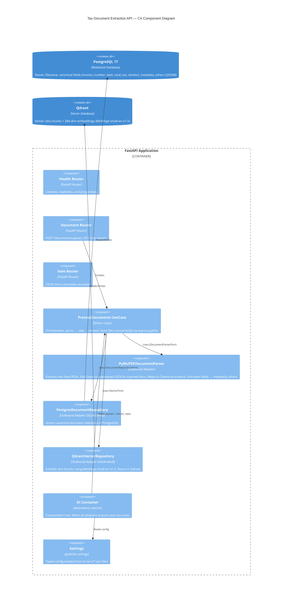

# 🧾 Tax Document Extraction API

A production-ready backend that accepts PDF tax documents, extracts structured data using a **text + OCR preprocessing pipeline**, stores canonical metadata in **PostgreSQL**, and persists vector embeddings in **Qdrant** for semantic search. Built with **FastAPI** following **Hexagonal Architecture** (Ports & Adapters).

---

## 📐 Architecture

### C4 Component Diagram



---

## 🔄 Preprocessing Pipeline

```
PDF Upload
    │
    ▼
┌───────────────────────┐
│  1. Text Extraction    │  ← PyMuPDF (fitz)
│     (per page)         │
└──────────┬────────────┘
           │  < 50 chars extracted?
           ▼
┌───────────────────────┐
│  2. OCR Fallback       │  ← pytesseract on page images
│     (scanned PDFs)     │
└──────────┬────────────┘
           │
           ▼
┌───────────────────────┐
│  3. Canonical Mapping  │  ← Hybrid extraction pipeline:
│                        │    1. Local Form 220 Positional mapping (fast, local)
│                        │    2. Regex heuristic mapping (pattern matching)
│                        │    3. AI LLM extraction (fallback for other forms/invoices)
└──────────┬────────────┘
           │
           ▼
┌───────────────────────┐
│  4. Chunking           │  500-char chunks, 50-char overlap
│     (per page)         │  Preserves page boundary context
└──────────┬────────────┘
           │
           ▼
┌───────────────────────┐
│  5. Embedding          │  BAAI/bge-small-en-v1.5 (384-dim)
│     (FastEmbed)        │  Runs via asyncio.run_in_executor
└──────────┬────────────┘
           │
           ▼
┌──────────┬────────────┐
│ Postgres  │  Qdrant    │
│ metadata  │  vectors   │
└───────────┴────────────┘
```

### 🧠 Hybrid Extraction Strategies
The mapping stage follows a waterfall fallback design to ensure maximum reliability and lower latency:
1. **Positional Mapping**: When a Form 220 layout is identified, it extracts fields based on sequential structured cell values (extremely precise, fast, and local).
2. **Regex Heuristics**: Extracts fields based on pattern matching (e.g. document IDs, company NITs, values).
3. **AI LLM Extraction (Optional Fallback)**: If critical fields (like employee name or gross income) are still missing, or if the document is of a completely different structure (e.g., invoices, other certificates), the pipeline calls Gemini or OpenAI to extract fields into the canonical schema.

To enable AI extraction, set either `GEMINI_API_KEY` or `OPENAI_API_KEY` in your environment or configuration:
```bash
export GEMINI_API_KEY="your-gemini-key"
# or
export OPENAI_API_KEY="your-openai-key"
```

**Parallel processing**: Multiple uploaded PDFs are processed concurrently via `asyncio.gather`. Each pipeline stage is `async` to avoid blocking the event loop. The embedding model runs in a thread executor to prevent I/O starvation.

---

## 🚀 Setup & Run

### Prerequisites
- Docker & Docker Compose
- Python 3.14+ with `uv`
- Tesseract OCR installed on the host (for OCR fallback)

### 1. Start Infrastructure

```bash
docker compose -f docker/docker-compose.local.yml up -d
```

This starts:
- `postgres:17-alpine` on port `5432`
- `qdrant/qdrant:v1.12.0` on port `6333`

### 2. Install Dependencies

```bash
uv sync --all-extras
```

### 3. Configure Environment

Copy and edit the dev environment file:

```bash
# src/env/DEV.env — already configured for local Docker
# Inject secrets at runtime:
export DATABASE_PASSWORD=localpassword
export SECRET_KEY=local-dev-secret
```

### 4. Run the API

```bash
APP_ENV=dev DATABASE_PASSWORD=localpassword SECRET_KEY=local-dev-secret \
    uv run uvicorn app.infrastructure.main:app --reload
```

Or using the Dockerfile:

```bash
docker build -t tax-extractor .
docker run -p 8000:8000 \
  -e APP_ENV=dev \
  -e DATABASE_PASSWORD=localpassword \
  -e SECRET_KEY=local-dev-secret \
  tax-extractor
```

---

## 📡 API Endpoints

| Method | Endpoint | Description |
|--------|----------|-------------|
| GET | `/health` | Liveness probe |
| GET | `/ready` | Readiness probe |
| POST | `/api/v1/documents/upload` | Upload 1–N PDF files for extraction |
| GET | `/api/v1/documents` | List all extracted documents |

Interactive docs: **http://localhost:8000/docs**

### Upload Example

```bash
curl -X POST "http://localhost:8000/api/v1/documents/upload" \
  -F "files=@invoice1.pdf" \
  -F "files=@invoice2.pdf"
```

### Response Format (JSend)

```json
{
  "status": "success",
  "data": [
    {
      "id": "...",
      "filename": "invoice1.pdf",
      "invoice_number": "INV-0042",
      "vendor": "ACME Corp",
      "total_tax": 152.50,
      "chunks_processed": 4
    }
  ]
}
```

---

## ⚡ Design Decisions

| Concern | Decision | Rationale |
|---------|----------|-----------|
| Architecture | Hexagonal (Ports & Adapters) | Decouples domain from infra; easy to swap adapters |
| Vector DB | Qdrant + FastEmbed | Lightweight Docker image; native Python SDK |
| Embedding model | `BAAI/bge-small-en-v1.5` (HuggingFace) | Self-contained, no API key needed, 384-dim cosine similarity |
| OCR | pytesseract | Battle-tested; Tesseract is the standard open-source OCR engine |
| PDF parsing | PyMuPDF | Fastest Python PDF library; handles text, images, and metadata |
| Chunking | 500 chars / 50 overlap | Balances context preservation and embedding quality for tables |
| Parallelism | `asyncio.gather` | Saturates I/O waits; parser and DB writes run concurrently |
| DI | `dependency-injector` | Composition root pattern; testable via container overrides |

---

## 🧪 Development

```bash
# Run tests
uv run pytest

# Run linter
uv run ruff check src/

# Run type checker
uv run mypy src/
```
